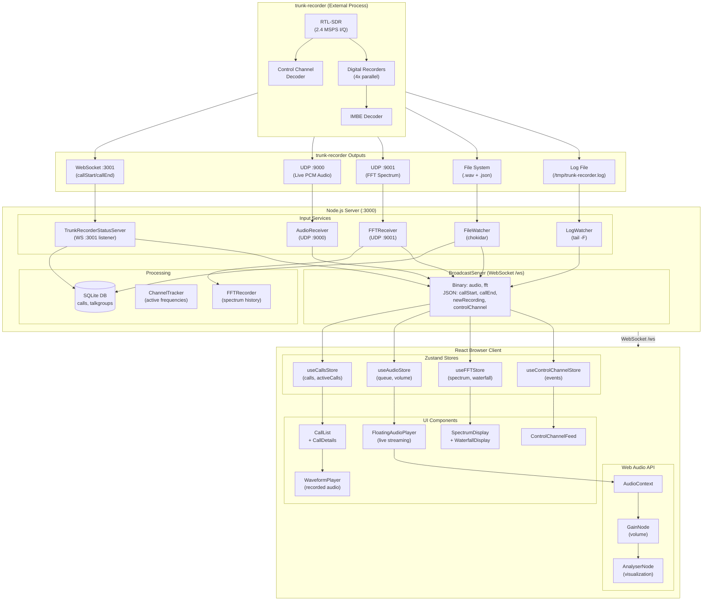
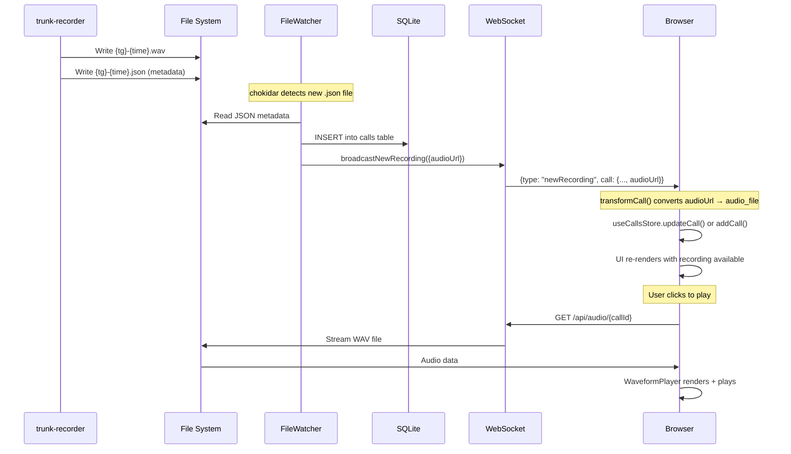
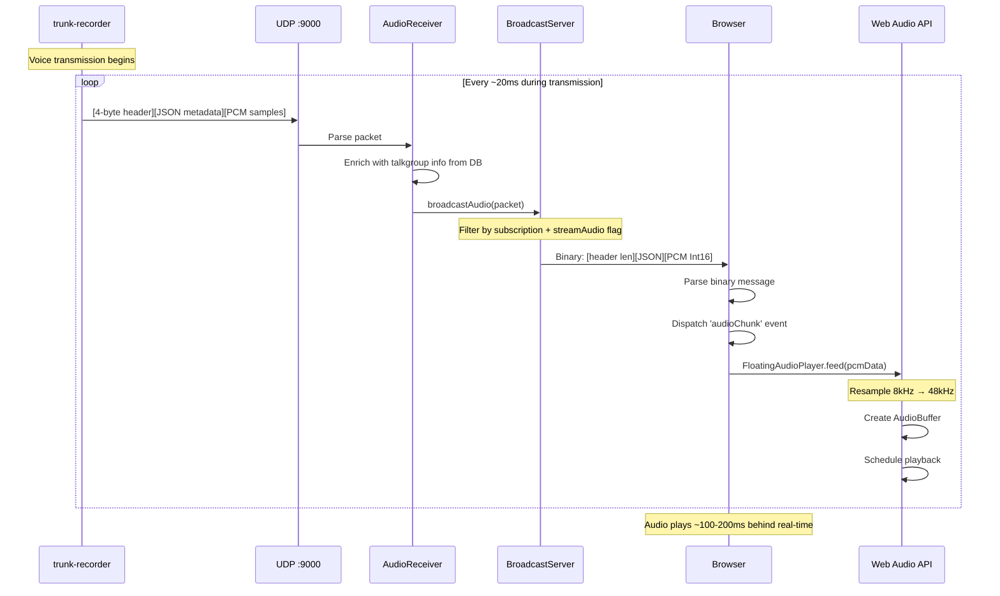

# Radio Scanner Web Interface

A real-time P25 trunked radio scanner web application that captures radio traffic over-the-air using an RTL-SDR, decodes it using trunk-recorder, and streams it to a web browser.

## Table of Contents

1. [Features](#features)
2. [How P25 Radio Works](#how-p25-radio-works)
3. [Hardware: RTL-SDR v3](#hardware-rtl-sdr-v3)
4. [The Decoding Pipeline](#the-decoding-pipeline)
5. [Project Architecture](#project-architecture)
6. [Real-Time Data Flow](#real-time-data-flow)
7. [Libraries and Dependencies](#libraries-and-dependencies)
8. [Limitations](#limitations)
9. [Setup and Configuration](#setup-and-configuration)
10. [Quick Install Scripts](#quick-install-scripts) (Windows, macOS, Linux)
11. [Connecting to trunk-recorder](#connecting-to-trunk-recorder)
12. [Installing trunk-recorder](#installing-trunk-recorder)
13. [Internal Data Flow (Mermaid Diagram)](#internal-data-flow-mermaid-diagram)
14. [How Audio Recordings Work](#how-audio-recordings-work)
15. [How Live Audio Streaming Works](#how-live-audio-streaming-works)
16. [API Endpoints Reference](#api-endpoints-reference)
17. [WebSocket Messages Reference](#websocket-messages-reference)
18. [Avtec Integration](./AVTEC.md) (for Prepared911 audio-collector)

---

## Features

### Live Radio Monitoring
- Real-time call streaming with talkgroup filtering
- Automatic audio playback queue for new transmissions
- Control channel event feed showing grants, call endings, and system info
- Active call indicators with frequency and duration

### Spectrum Visualization
- Real-time FFT waterfall display from RTL-SDR
- Multiple color schemes (viridis, plasma, grayscale, classic)
- Adjustable gain/range controls
- Spectrum recording and playback for analysis

### Control Channel Scanner
- Scan control channel frequencies from RadioReference database
- Real-time signal strength detection
- SNR-based activity classification
- County/state-based system discovery
- Visual indicators for in-range and active frequencies

### RadioReference Integration
- Browse P25 systems by state and county
- Import talkgroup lists automatically
- Control channel frequency database
- System site and coverage information

### Call History
- SQLite database for all recorded calls
- Searchable call history with filtering
- Waveform audio player with scrubbing
- Call metadata (sources, duration, frequency)

### Resizable Panel Layout
- Customizable workspace with draggable dividers
- Collapsible sidebar panels
- Persistent layout preferences

---

## How P25 Radio Works

### Overview

P25 (Project 25) is a suite of digital radio standards used by public safety organizations (police, fire, EMS) across North America. Unlike traditional analog radio where each channel is a fixed frequency, P25 systems use **trunking** - a method of dynamically assigning frequencies to conversations as needed.

### The Trunking Concept

Imagine a highway with multiple lanes (frequencies). Instead of assigning each department their own dedicated lane that sits empty when not in use, a traffic controller (the control channel) dynamically assigns lanes to vehicles (radio users) as they need them.

```
Traditional Radio:          Trunked Radio:
┌─────────────────┐         ┌─────────────────┐
│ Freq 1: Police  │         │ Control Channel │ ← Always broadcasting
│ Freq 2: Fire    │         │ Freq 1: [avail] │
│ Freq 3: EMS     │         │ Freq 2: [avail] │
│ Freq 4: Empty   │         │ Freq 3: [avail] │
└─────────────────┘         └─────────────────┘
                                    │
                            When Police Unit 5 keys up:
                                    ▼
                            ┌─────────────────┐
                            │ Control Channel │ → "TG 2001 → Freq 2"
                            │ Freq 1: [avail] │
                            │ Freq 2: TG 2001 │ ← Voice traffic here
                            │ Freq 3: [avail] │
                            └─────────────────┘
```

### Key P25 Concepts

#### Control Channel

The control channel is the brain of a P25 trunked system. It continuously broadcasts:

- **Talkgroup assignments**: "Talkgroup 2001 is now transmitting on 770.50625 MHz"
- **System information**: Available frequencies, system ID, network configuration
- **Unit registrations**: Which radios are active on the system
- **Emergency alerts**: Priority traffic notifications

The control channel transmits data packets at 9600 baud using either **CQPSK** (Compatible Quadrature Phase Shift Keying) or **C4FM** (Continuous 4-level FM) modulation, depending on whether the system is Phase 1 or Phase 2.

#### Talkgroups

Talkgroups are logical groupings of radio users. Instead of frequencies, users select talkgroups:

| Talkgroup ID | Name | Description |
|-------------|------|-------------|
| 2001 | PHX PD A1 | Phoenix Police Precinct A1 |
| 2811 | PHX FD A1 | Phoenix Fire Dispatch A1 |
| 3011 | CHAN PD | Chandler Police Dispatch |

When an officer keys their radio on talkgroup 2001, the control channel assigns a frequency and notifies all radios monitoring that talkgroup to tune in.

#### Voice Encoding: IMBE and AMBE+2

P25 doesn't transmit raw audio. Voice is compressed using vocoders:

- **Phase 1 (IMBE)**: Improved Multi-Band Excitation - ~4400 bps voice
- **Phase 2 (AMBE+2)**: Advanced Multi-Band Excitation - ~3600 bps voice, allows 2 voice channels per frequency (TDMA)

These vocoders were designed for intelligibility over low-bandwidth channels, not audio quality. The result is the characteristic "robotic" sound of digital radio.

### The RF Signal Path

```
Radio Transmission:
┌──────────────┐    RF Signal     ┌─────────────────┐
│ Police Radio │ ───────────────► │ Tower/Repeater  │
│ (Portable)   │   770-775 MHz    │                 │
└──────────────┘                  └────────┬────────┘
                                           │
                                           │ Rebroadcast
                                           ▼
                                  ┌─────────────────┐
                                  │ Your RTL-SDR    │
                                  │ Antenna         │
                                  └─────────────────┘
```

---

## Hardware: RTL-SDR v3

### What is RTL-SDR?

RTL-SDR (Software Defined Radio) devices are inexpensive USB dongles originally designed for DVB-T television reception. Hackers discovered the Realtek RTL2832U chip inside could be reprogrammed to receive raw radio signals across a wide frequency range.

### RTL-SDR v3 Specifications

| Parameter | Value |
|-----------|-------|
| Frequency Range | 500 kHz - 1.766 GHz |
| Sample Rate | Up to 2.4 MSPS (3.2 MSPS max) |
| ADC Resolution | 8-bit |
| Interface | USB 2.0 |
| Tuner Chip | R820T2 |

### How It Captures RF

The RTL-SDR is essentially a very fast analog-to-digital converter (ADC) that samples radio waves:

```
┌─────────────────────────────────────────────────────────────────┐
│                         RTL-SDR v3                              │
│                                                                 │
│  Antenna    R820T2 Tuner      RTL2832U         USB             │
│    │        ┌─────────┐      ┌─────────┐      ┌─────┐          │
│    │  RF    │ Mixer   │ IF   │ ADC     │ I/Q  │     │  Samples │
│ ───┼──────► │ + LNA   │────► │ 8-bit   │────► │ USB │────────► │
│    │        │         │      │ 2.4MSPS │      │     │          │
│    │        └─────────┘      └─────────┘      └─────┘          │
│                                                                 │
└─────────────────────────────────────────────────────────────────┘
```

1. **Antenna** receives electromagnetic waves
2. **R820T2 Tuner** down-converts the target frequency to an intermediate frequency (IF)
3. **RTL2832U** digitizes the IF signal into I/Q (In-phase/Quadrature) samples
4. **USB** streams raw samples to the computer

### Bandwidth and Spectrum Coverage

A key capability: the RTL-SDR can capture **2.4 MHz of spectrum simultaneously**. This means:

```
Center Frequency: 771.5 MHz
Sample Rate: 2.4 MSPS

        ◄──────────── 2.4 MHz ────────────►
        │                                  │
   770.3 MHz                          772.7 MHz
        │    │    │    │    │    │    │    │
        └────┴────┴────┴────┴────┴────┴────┘
              Multiple P25 channels captured
              simultaneously in this window
```

This is crucial for trunked systems - we can monitor multiple voice frequencies at once without re-tuning.

### Antenna Considerations

For 700-800 MHz P25 systems:
- **Wavelength**: ~40 cm (λ = c/f)
- **Quarter-wave antenna**: ~10 cm
- **Recommended**: Discone or dedicated 700-800 MHz antenna
- **Line of sight**: Higher placement = better reception

---

## The Decoding Pipeline

### trunk-recorder

[trunk-recorder](https://github.com/robotastic/trunk-recorder) is the core software that transforms raw RF samples into audio. It's written in C++ and uses GNU Radio for signal processing.

### Step-by-Step Decoding Process

```
┌─────────────────────────────────────────────────────────────────────────────┐
│                           DECODING PIPELINE                                  │
└─────────────────────────────────────────────────────────────────────────────┘

1. RF CAPTURE (RTL-SDR)
   ┌─────────────────┐
   │ Raw I/Q Samples │  2.4 million samples/second
   │ 8-bit complex   │  Each sample = I + jQ
   └────────┬────────┘
            │
            ▼
2. CONTROL CHANNEL DECODING
   ┌─────────────────────────────────────────────┐
   │ • Find control channel (770.10625 MHz)      │
   │ • Demodulate CQPSK/C4FM → 9600 baud data   │
   │ • Decode TSBK (Trunking Signaling Block)    │
   │ • Extract: Channel grants, TG assignments   │
   └────────┬────────────────────────────────────┘
            │
            │  "TG 2001 granted frequency 770.50625 MHz"
            ▼
3. VOICE CHANNEL RECORDING
   ┌─────────────────────────────────────────────┐
   │ • Tune digital recorder to granted freq     │
   │ • Demodulate CQPSK/C4FM signal             │
   │ • Extract IMBE/AMBE+2 voice frames         │
   │ • Track frequency changes (late entry)      │
   └────────┬────────────────────────────────────┘
            │
            │  Compressed voice frames (4400 bps)
            ▼
4. VOICE DECODING
   ┌─────────────────────────────────────────────┐
   │ • Decode IMBE codec → PCM audio            │
   │ • 8000 Hz sample rate, 16-bit              │
   │ • Apply audio filtering                     │
   └────────┬────────────────────────────────────┘
            │
            │  Raw PCM audio
            ▼
5. OUTPUT
   ┌─────────────────────────────────────────────┐
   │ • Save as WAV file with JSON metadata       │
   │ • Stream via UDP (live audio)               │
   │ • Send status via WebSocket                 │
   └─────────────────────────────────────────────┘
```

### Control Channel Message Types

trunk-recorder continuously decodes these message types from the control channel:

| Message Type | Purpose |
|-------------|---------|
| GRP_V_CH_GRANT | Voice channel grant - "TG X is transmitting on Freq Y" |
| GRP_V_CH_GRANT_UPDT | Channel update during ongoing call |
| UNIT_REG_RSP | Radio unit registration acknowledgment |
| IDEN_UP | Channel identifier update (frequency table) |
| ADJ_STS_BCAST | Adjacent site broadcast |
| RFSS_STS_BCAST | RF subsystem status |

### Digital Recorder Allocation

trunk-recorder maintains a pool of "digital recorders" - software demodulators that can each track one voice channel:

```javascript
// From config.json
{
  "sources": [{
    "center": 771500000,      // Center frequency (771.5 MHz)
    "rate": 2400000,          // 2.4 MSPS bandwidth
    "digitalRecorders": 4,    // Can record 4 simultaneous calls
    "driver": "osmosdr",      // RTL-SDR driver
    "device": "rtl=0"         // First RTL-SDR device
  }]
}
```

With 4 digital recorders, the system can decode 4 simultaneous conversations within the 2.4 MHz capture window.

### IMBE Codec

The IMBE (Improved Multi-Band Excitation) codec is the voice compression standard for P25 Phase 1:

```
Voice Input (8000 Hz) ──► IMBE Encoder ──► 4400 bps bitstream
                                │
                    ┌───────────┴───────────┐
                    │  Frame Structure:      │
                    │  • 20ms voice frame   │
                    │  • 88 bits per frame  │
                    │  • Error correction   │
                    └───────────────────────┘
```

trunk-recorder uses either:
- **OP25** library (open source IMBE decoder)
- **Digital Speech Decoder (DSD)** for AMBE+2

---

## Project Architecture

This project wraps trunk-recorder with a modern web interface, providing real-time streaming, spectrum visualization, and historical playback.

> For detailed technical documentation, see [ARCHITECTURE.md](./ARCHITECTURE.md)

### System Overview

```
┌─────────────────────────────────────────────────────────────────────────────┐
│                              SYSTEM ARCHITECTURE                             │
└─────────────────────────────────────────────────────────────────────────────┘

   ┌──────────────┐
   │   RTL-SDR    │
   │   Antenna    │
   └──────┬───────┘
          │ USB (I/Q samples @ 2.4 MSPS)
          ▼
   ┌──────────────────────────────────────────────────────────────┐
   │                      TRUNK-RECORDER                          │
   │  ┌─────────────┐  ┌─────────────┐  ┌─────────────┐          │
   │  │  Control    │  │  Digital    │  │  Digital    │          │
   │  │  Channel    │  │  Recorder 1 │  │  Recorder 2 │  ...     │
   │  │  Decoder    │  │             │  │             │          │
   │  └──────┬──────┘  └──────┬──────┘  └──────┬──────┘          │
   │         │                │                │                  │
   │         ▼                ▼                ▼                  │
   │  ┌─────────────────────────────────────────────────────┐    │
   │  │              Output Streams                          │    │
   │  │  • UDP 9000: FFT spectrum data (real-time)          │    │
   │  │  • UDP 9001: PCM audio stream                       │    │
   │  │  • WebSocket 3001: Call status events               │    │
   │  │  • Files: WAV recordings + JSON metadata            │    │
   │  │  • Log: /tmp/trunk-recorder.log                     │    │
   │  └─────────────────────────────────────────────────────┘    │
   └──────────────────────────────────────────────────────────────┘
          │                    │                    │
          ▼                    ▼                    ▼
   ┌──────────────────────────────────────────────────────────────┐
   │                         NODE.JS SERVER                        │
   │                                                               │
   │  ┌──────────────┐  ┌──────────────┐  ┌──────────────┐        │
   │  │ FFTReceiver  │  │AudioReceiver │  │ StatusServer │        │
   │  │  UDP 9000    │  │  UDP 9001    │  │   WS 3001    │        │
   │  └──────┬───────┘  └──────┬───────┘  └──────┬───────┘        │
   │         │                 │                 │                 │
   │  ┌──────┴───────┐  ┌──────┴───────┐  ┌──────┴───────┐        │
   │  │ LogWatcher   │  │ FileWatcher  │  │ RadioRef DB  │        │
   │  └──────┬───────┘  └──────┬───────┘  └──────┬───────┘        │
   │         │                 │                 │                 │
   │         └────────────┬────┴─────────────────┘                 │
   │                      ▼                                        │
   │  ┌─────────────────────────────────────────────────────┐     │
   │  │              SPECTRUM ANALYSIS                       │     │
   │  │  • FrequencyScanner: Real-time signal detection     │     │
   │  │  • FFTRecorder: Record spectrum for analysis        │     │
   │  │  • FFTReplayer: Playback recorded spectrum          │     │
   │  └─────────────────────────────────────────────────────┘     │
   │                      │                                        │
   │                      ▼                                        │
   │  ┌─────────────────────────────────────────────────────┐     │
   │  │              BROADCAST SERVER                        │     │
   │  │  WebSocket /ws - Binary (FFT, Audio) + JSON          │     │
   │  └─────────────────────────────────────────────────────┘     │
   │                      │                                        │
   │  ┌───────────────────┴───────────────────┐                   │
   │  │            SQLite Database             │                   │
   │  │  calls, talkgroups, radioreference     │                   │
   │  └───────────────────────────────────────┘                   │
   └──────────────────────────────────────────────────────────────┘
                                │
                                │ WebSocket (JSON + Binary)
                                ▼
   ┌──────────────────────────────────────────────────────────────┐
   │                       WEB BROWSER                             │
   │                                                               │
   │  ┌─────────────┐ ┌─────────────┐ ┌─────────────┐ ┌─────────┐│
   │  │ Spectrum    │ │ Call Feed   │ │ Audio Queue │ │ Scanner ││
   │  │ Waterfall   │ │ & History   │ │ & Player    │ │ (CC)    ││
   │  └─────────────┘ └─────────────┘ └─────────────┘ └─────────┘│
   │                                                               │
   │  ┌─────────────────────────────────────────────────────────┐ │
   │  │  Zustand Stores: fft, calls, audio, radioreference      │ │
   │  └─────────────────────────────────────────────────────────┘ │
   └──────────────────────────────────────────────────────────────┘
```

### Data Flow

#### 1. Status Messages (trunk-recorder → Server → Browser)

```
trunk-recorder                    Node.js Server                Browser
      │                                 │                          │
      │ ══════ WebSocket ══════════════►│                          │
      │ {                               │                          │
      │   "type": "call_start",         │                          │
      │   "call": {                     │ ════ WebSocket /ws ═════►│
      │     "talkgroup": 2001,          │ {                        │
      │     "freq": 770506250,          │   "type": "callStart",   │
      │     "talkgrouptag": "PHX PD"    │   "call": {...}          │
      │   }                             │ }                        │
      │ }                               │                          │
```

#### 2. Live Audio Streaming (trunk-recorder → Server → Browser)

```
trunk-recorder                    Node.js Server                Browser
      │                                 │                          │
      │ ═══════ UDP 9123 ══════════════►│                          │
      │ [4-byte TGID][PCM samples]      │                          │
      │                                 │ ═══ WebSocket Binary ════►
      │                                 │ [4-byte header len]       │
      │                                 │ [JSON header]             │
      │                                 │ [PCM samples]             │
      │                                 │                          │
      │                                 │                    ┌──────┴──────┐
      │                                 │                    │ Web Audio   │
      │                                 │                    │ API plays   │
      │                                 │                    │ PCM buffer  │
      │                                 │                    └─────────────┘
```

#### 3. Recorded Calls (File System → Server → Browser)

```
trunk-recorder writes:                Node.js Server
./audio/2001/call-123.wav            FileWatcher detects new .json
./audio/2001/call-123.json    ─────► Parses metadata
                                     Inserts into SQLite
                                     Broadcasts to clients
```

### Server Components

#### TrunkRecorderStatusServer (`status-server.ts`)

Listens for WebSocket connections from trunk-recorder on port 3001. Receives:
- `call_start`: New call beginning
- `call_end`: Call completed with full metadata
- `calls_active`: Periodic list of ongoing calls
- `rates`: Decode rate statistics

#### AudioReceiver (`audio-receiver.ts`)

UDP socket listener for live audio streams. trunk-recorder sends PCM audio packets with a 4-byte talkgroup ID prefix. The receiver parses these and forwards to connected browsers.

#### FileWatcher (`file-watcher.ts`)

Uses [chokidar](https://github.com/paulmillr/chokidar) to watch the audio directory for new recordings. When trunk-recorder writes a `.json` metadata file, it's parsed and the call is stored in the database.

#### BroadcastServer (`websocket.ts`)

WebSocket server for browser clients. Features:
- Talkgroup subscription filtering
- Binary audio packet forwarding
- JSON message broadcasting

### Database Schema

```sql
CREATE TABLE talkgroups (
    id INTEGER PRIMARY KEY,
    alpha_tag TEXT,
    description TEXT,
    group_name TEXT,
    group_tag TEXT
);

CREATE TABLE calls (
    id TEXT PRIMARY KEY,
    talkgroup_id INTEGER,
    frequency INTEGER,
    start_time INTEGER,
    stop_time INTEGER,
    duration REAL,
    emergency BOOLEAN,
    encrypted BOOLEAN,
    audio_file TEXT,
    audio_type TEXT
);

CREATE TABLE call_sources (
    id INTEGER PRIMARY KEY,
    call_id TEXT,
    source_id INTEGER,
    timestamp INTEGER,
    position INTEGER,
    emergency BOOLEAN,
    tag TEXT
);
```

---

## Real-Time Data Flow

This section describes how data flows from the RTL-SDR through trunk-recorder to the web client in real-time.

### FFT Spectrum Data Pipeline

```
RTL-SDR (2.4 MSPS I/Q samples)
    │
    ▼
trunk-recorder FFT processing
    │
    │  UDP packets to port 9000
    │  Binary format:
    │  ┌────────────────┬─────────────┬──────────┬──────────────┬─────────────┐
    │  │ Magic "FFTD"   │ Meta Length │ FFT Size │ JSON Meta    │ Float32 dB  │
    │  │ 4 bytes        │ 4 bytes     │ 4 bytes  │ variable     │ fftSize * 4 │
    │  └────────────────┴─────────────┴──────────┴──────────────┴─────────────┘
    ▼
FFTReceiver (server/src/services/trunk-recorder/fft-receiver.ts)
    │
    ├─► FrequencyScanner: Real-time signal detection
    │   • Calculates signal strength at specific frequencies
    │   • Estimates noise floor (excluding 50kHz radius)
    │   • Determines SNR and activity status
    │
    ├─► FFTRecorder: Saves packets for later replay
    │
    └─► BroadcastServer: Streams to subscribed clients
        │
        │  WebSocket binary message:
        │  ┌─────────────────┬──────────────────┬─────────────────┐
        │  │ Header Length   │ JSON Header      │ Float32 FFT     │
        │  │ 4 bytes (LE)    │ {type, freq...}  │ magnitudes dB   │
        │  └─────────────────┴──────────────────┴─────────────────┘
        ▼
Web Client FFT Store
    │
    ├─► currentFFT: Latest spectrum data
    ├─► waterfallHistory: Ring buffer (256 rows)
    └─► Spectrum/Waterfall visualization
```

### Control Channel Events Pipeline

```
trunk-recorder log (/tmp/trunk-recorder.log)
    │
    │  Log entries parsed by regex:
    │  "Starting P25 Recorder" → grant event
    │  "Stopping P25 Recorder" → end event
    │  "ENCRYPTED" → encrypted event
    │
    ▼
LogWatcher (server/src/services/trunk-recorder/log-watcher.ts)
    │
    │  Emits ControlChannelEvent:
    │  {
    │    timestamp, type, talkgroup, frequency,
    │    recorder, tdmaSlot, encrypted, emergency,
    │    unit, decodeRate, wacn, nac, systemId
    │  }
    │
    ├─► FFTRecorder: Records events with spectrum
    │
    └─► BroadcastServer: JSON to all clients
        │
        ▼
Web Client Control Channel Feed
    • Color-coded by event type
    • Shows talkgroup, frequency, unit info
    • Limited to 200 events in history
```

### Signal Detection Algorithm

The frequency scanner uses this algorithm to detect active signals:

```
1. Receive FFT packet with magnitudes[] in dB

2. For target frequency:
   • Calculate bin index: (targetFreq - minFreq) / binWidth
   • Get signal strength: magnitudes[binIndex]

3. Calculate noise floor:
   • Collect bins > 50kHz away from target
   • Average these values

4. Calculate SNR:
   • snr = signalStrength - noiseFloor

5. Determine status:
   • Active: signalStrength > -85dB AND snr > 10dB
   • Weak: signalStrength > -95dB AND snr > 5dB
   • Inactive: otherwise
```

### WebSocket Message Types

| Type | Format | Direction | Description |
|------|--------|-----------|-------------|
| `connected` | JSON | S→C | Client ID assignment |
| `callStart` | JSON | S→C | New transmission begins |
| `callEnd` | JSON | S→C | Transmission complete |
| `callsActive` | JSON | S→C | List of ongoing calls |
| `newRecording` | JSON | S→C | Recording ready for playback |
| `controlChannel` | JSON | S→C | Control channel event |
| `rates` | JSON | S→C | Decode rate statistics |
| `fft` | Binary | S→C | Spectrum data |
| `audio` | Binary | S→C | PCM audio samples |
| `subscribeAll` | JSON | C→S | Subscribe to all traffic |
| `subscribe` | JSON | C→S | Subscribe to talkgroups |
| `unsubscribe` | JSON | C→S | Unsubscribe from talkgroups |
| `enableAudio` | JSON | C→S | Toggle audio streaming |
| `enableFFT` | JSON | C→S | Toggle FFT streaming |

---

## Libraries and Dependencies

### trunk-recorder (C++)

| Library | Purpose |
|---------|---------|
| **GNU Radio** | Signal processing framework - DSP blocks for demodulation |
| **gr-osmosdr** | RTL-SDR interface for GNU Radio |
| **OP25** | P25 protocol decoder and IMBE vocoder |
| **libcurl** | HTTP uploads for remote archiving |
| **Boost** | C++ utilities |

### Node.js Server

| Package | Purpose |
|---------|---------|
| **fastify** | High-performance HTTP server |
| **ws** | WebSocket server/client |
| **better-sqlite3** | Synchronous SQLite bindings |
| **chokidar** | Cross-platform file watching |

### Web Client

| Package | Purpose |
|---------|---------|
| **React** | UI framework |
| **Vite** | Build tool and dev server |
| **Zustand** | Lightweight state management |
| **TailwindCSS** | Utility-first CSS |
| **Web Audio API** | Browser audio playback |

---

## Limitations

### Hardware Limitations

| Limitation | Impact | Mitigation |
|------------|--------|------------|
| **8-bit ADC** | Limited dynamic range (~48 dB) | Use appropriate gain settings |
| **2.4 MHz bandwidth** | Can't cover entire P25 band at once | Position center frequency strategically |
| **USB 2.0 throughput** | Sample rate capped at ~2.4 MSPS reliably | Sufficient for most P25 systems |
| **No transmit capability** | Receive only | N/A - this is intentional |
| **Frequency drift** | Cheap oscillator drifts with temperature | Use PPM correction, TCXO version |

### Software Limitations

| Limitation | Impact | Mitigation |
|------------|--------|------------|
| **Single SDR support** | Can't cover frequencies > 2.4 MHz apart | Use multiple instances with multiple SDRs |
| **IMBE decoder quality** | Some voice frames may have artifacts | Inherent to vocoder technology |
| **CPU intensive** | Each recorder uses ~10% CPU | Use dedicated hardware |
| **No P25 Phase 2 TDMA** | Some modern systems unsupported | Check your local system type |

### Protocol Limitations

| Limitation | Description |
|------------|-------------|
| **Encryption** | Cannot decode encrypted calls (AES-256) - will show as "encrypted" |
| **Late entry** | May miss beginning of calls if control channel grant was missed |
| **Simulcast distortion** | Multiple towers can cause phase distortion |
| **Weak signals** | Digital cliff effect - signal works perfectly until it doesn't |

### Legal Considerations

- Listening to radio transmissions is generally legal in the United States (with exceptions)
- Recording and sharing audio may have additional restrictions
- Some states prohibit mobile scanning while driving
- Always verify local regulations

---

## Setup and Configuration

### Prerequisites

1. **RTL-SDR v3** with appropriate antenna
2. **trunk-recorder** installed and compiled
3. **Node.js** 18+ and npm
4. Control channel frequencies for your local P25 system (find at [RadioReference.com](https://radioreference.com))

### Configuration

1. **trunk-recorder config.json**:

```json
{
  "sources": [{
    "center": 771500000,
    "rate": 2400000,
    "gain": 40,
    "digitalRecorders": 4,
    "driver": "osmosdr",
    "device": "rtl=0"
  }],
  "systems": [{
    "shortName": "rwc",
    "type": "p25",
    "talkgroupsFile": "talkgroups.csv",
    "control_channels": [770106250, 770356250],
    "modulation": "qpsk"
  }],
  "statusServer": "ws://127.0.0.1:3001"
}
```

2. **Start the server**:

```bash
npm install
npm run build
npm start
```

3. **Start trunk-recorder**:

```bash
cd trunk-recorder
./trunk-recorder --config=config.json
```

4. **Open browser**: Navigate to `http://localhost:3000`

---

## Quick Install Scripts

The easiest way to install the **web application** is using the provided installation scripts. These scripts handle Node.js and npm dependencies automatically.

> **Note:** These scripts install the web interface only. To receive actual radio traffic, you also need [trunk-recorder](#installing-trunk-recorder) with an RTL-SDR device.

### Windows (PowerShell)

```powershell
# 1. Download/clone the project and open PowerShell in the project folder

# 2. Allow script execution (run once, as Administrator)
Set-ExecutionPolicy -ExecutionPolicy RemoteSigned -Scope CurrentUser

# 3. Run the installer
.\install-windows.ps1
```

The script will:
- Check/install Node.js 18+ (via winget if available)
- Check for Visual Studio Build Tools
- Install npm dependencies
- Build the project
- Verify everything works

### macOS

```bash
# 1. Download/clone the project and open Terminal in the project folder

# 2. Make executable and run
chmod +x install-mac.sh
./install-mac.sh
```

The script will:
- Check/install Homebrew
- Check/install Node.js 18+
- Install npm dependencies
- Build the project
- Verify everything works

### Linux (Ubuntu/Debian, Fedora/RHEL, Arch)

```bash
# 1. Download/clone the project and open Terminal in the project folder

# 2. Make executable and run
chmod +x install-linux.sh
./install-linux.sh
```

The script will:
- Detect your package manager (apt, dnf, yum, pacman)
- Install system dependencies (build tools, curl, python3)
- Check/install Node.js 18+ via NodeSource
- Install npm dependencies
- Build the project
- Verify everything works

### After Installation

```bash
# Start the server
npm start

# Open in browser
http://localhost:3000

# For development with hot reload
npm run dev
```

---

## Manual Installation

If you prefer to install manually or the scripts don't work for your system:

### Prerequisites

1. **Node.js 18+**: Download from [nodejs.org](https://nodejs.org/)
2. **Build tools** (for native npm modules):
   - **Windows**: [Visual Studio Build Tools](https://visualstudio.microsoft.com/visual-cpp-build-tools/) with "Desktop development with C++"
   - **macOS**: Xcode Command Line Tools (`xcode-select --install`)
   - **Linux**: `build-essential` (Debian/Ubuntu), `base-devel` (Arch), `gcc-c++ make` (Fedora)

### Steps

```bash
# 1. Clone the project
git clone https://github.com/your-username/radio.git
cd radio

# 2. Install dependencies
npm install

# 3. Build
npm run build

# 4. Start
npm start

# 5. Open http://localhost:3000
```

---

## Connecting to trunk-recorder

trunk-recorder sends audio and status data to this server. Configure trunk-recorder's `config.json`:

```json
{
  "statusServer": "ws://SERVER_IP:3001",
  "simpleStream": {
    "streams": [{
      "address": "SERVER_IP",
      "port": 9000,
      "sendTGID": true,
      "sendJSON": true,
      "shortName": "your-system"
    }]
  }
}
```

Replace `SERVER_IP` with:
- `localhost` or `127.0.0.1` if running on the same machine
- Your server's IP address if running remotely

### Firewall Configuration

**Windows (PowerShell as Administrator):**
```powershell
New-NetFirewallRule -DisplayName "Radio Scanner" -Direction Inbound -LocalPort 3000,3001,9000 -Protocol TCP -Action Allow
New-NetFirewallRule -DisplayName "Radio Scanner UDP" -Direction Inbound -LocalPort 9000 -Protocol UDP -Action Allow
```

**Linux (ufw):**
```bash
sudo ufw allow 3000/tcp
sudo ufw allow 3001/tcp
sudo ufw allow 9000/udp
```

**Linux (firewalld):**
```bash
sudo firewall-cmd --add-port=3000/tcp --permanent
sudo firewall-cmd --add-port=3001/tcp --permanent
sudo firewall-cmd --add-port=9000/udp --permanent
sudo firewall-cmd --reload
```

---

## Installing trunk-recorder

trunk-recorder is a separate C++ application that decodes P25 radio signals from an RTL-SDR device. It requires its own dependencies beyond what npm provides.

### Hardware Required

- **RTL-SDR v3** (or compatible SDR) - ~$30 USB dongle
- **Antenna** suitable for 700-900 MHz (for P25 systems)

### Option 1: Pre-built Packages (Easiest)

**Ubuntu/Debian:**
```bash
# Add trunk-recorder PPA
sudo add-apt-repository ppa:robotastic/trunk-recorder
sudo apt update
sudo apt install trunk-recorder
```

**Arch Linux (AUR):**
```bash
yay -S trunk-recorder
```

### Option 2: Build from Source

**Ubuntu/Debian:**
```bash
# Install dependencies
sudo apt update
sudo apt install -y \
  git cmake build-essential \
  gnuradio-dev libuhd-dev libhackrf-dev \
  gr-osmosdr libsndfile1-dev libssl-dev \
  libcurl4-openssl-dev pkg-config \
  fdkaac sox

# Clone and build
git clone https://github.com/robotastic/trunk-recorder.git
cd trunk-recorder
mkdir build && cd build
cmake ..
make -j$(nproc)
sudo make install
```

**macOS (Homebrew):**
```bash
# Install dependencies
brew install cmake gnuradio hackrf librtlsdr uhd libsndfile openssl curl pkg-config sox fdkaac

# Clone and build
git clone https://github.com/robotastic/trunk-recorder.git
cd trunk-recorder
mkdir build && cd build
cmake ..
make -j$(sysctl -n hw.ncpu)
```

**Windows (WSL2 recommended):**

trunk-recorder is primarily designed for Linux. On Windows, use WSL2:

```powershell
# Install WSL2 with Ubuntu
wsl --install -d Ubuntu

# Then follow Ubuntu instructions above inside WSL2
```

### RTL-SDR Driver Setup

**Linux:**
```bash
# Install RTL-SDR tools
sudo apt install rtl-sdr

# Blacklist kernel DVB drivers (required)
echo 'blacklist dvb_usb_rtl28xxu' | sudo tee /etc/modprobe.d/blacklist-rtl.conf
sudo modprobe -r dvb_usb_rtl28xxu

# Test RTL-SDR
rtl_test -t
```

**macOS:**
```bash
brew install librtlsdr
rtl_test -t
```

**Windows:**
Use [Zadig](https://zadig.akeo.ie/) to install WinUSB driver for the RTL-SDR device.

### Verifying Installation

```bash
# Check trunk-recorder is installed
trunk-recorder --help

# Test RTL-SDR device
rtl_test -t
# Should show: "Found 1 device(s)"
```

### trunk-recorder Configuration

Create a `config.json` in your trunk-recorder directory:

```json
{
  "ver": 2,
  "sources": [{
    "center": 851000000,
    "rate": 2400000,
    "gain": 40,
    "digitalRecorders": 4,
    "driver": "osmosdr",
    "device": "rtl=0"
  }],
  "systems": [{
    "shortName": "example",
    "type": "p25",
    "control_channels": [851012500, 851262500],
    "modulation": "qpsk",
    "talkgroupsFile": "talkgroups.csv"
  }],
  "statusServer": "ws://127.0.0.1:3001",
  "simpleStream": {
    "streams": [{
      "address": "127.0.0.1",
      "port": 9000,
      "sendTGID": true,
      "sendJSON": true,
      "shortName": "example"
    }]
  },
  "captureDir": "./audio",
  "logFile": "/tmp/trunk-recorder.log"
}
```

Key configuration:
- `center`: Center frequency to tune to (Hz)
- `control_channels`: Your local P25 control channel frequencies
- `statusServer`: WebSocket URL for this Radio Scanner
- `simpleStream`: UDP audio stream to this Radio Scanner

### Running trunk-recorder

```bash
cd /path/to/trunk-recorder
./trunk-recorder --config=config.json
```

Or with logging:
```bash
./trunk-recorder --config=config.json 2>&1 | tee /tmp/trunk-recorder-output.log
```

---

### Finding Your Local System

1. Go to [RadioReference.com](https://radioreference.com)
2. Search for your county/city
3. Look for "Project 25" or "P25" systems
4. Note the control channel frequencies
5. Download the talkgroup list

---

## Internal Data Flow (Mermaid Diagram)

The following diagram shows how data flows through the system in detail:



---

## How Audio Recordings Work

When trunk-recorder completes a call, the recording flows through the system as follows:

### Recording Creation Flow



### Key Points

1. **File Detection**: The `FileWatcher` uses chokidar to watch for new `.json` files in the audio directory
2. **Metadata Parsing**: JSON contains talkgroup, frequency, start/stop times, duration, and source units
3. **Database Storage**: Call record is inserted with `audio_file` pointing to the WAV path
4. **WebSocket Broadcast**: `newRecording` message sent with `audioUrl` (e.g., `/api/audio/812-1736554765`)
5. **Client Update**: The `transformCall()` function normalizes field names (`audioUrl` → `audio_file`)
6. **UI Rendering**: `CallDetails` component shows `WaveformPlayer` when `audio_file` is present

### Audio File Naming

trunk-recorder creates files with this pattern:
```
{talkgroup}-{startTime}_{frequency}-call_{N}.wav
{talkgroup}-{startTime}_{frequency}-call_{N}.json

Example: 812-1736554765_852387500.0-call_42.wav
```

The call ID used internally is: `{talkgroup}-{startTime}` (e.g., `812-1736554765`)

---

## How Live Audio Streaming Works

Live audio streaming allows you to hear radio traffic in real-time as it's being received.

### Live Audio Flow



### Enabling Live Audio

1. **Client requests streaming**: Sends `{type: "enableAudio", enabled: true}` via WebSocket
2. **Server tracks subscribers**: `BroadcastServer` sets `client.streamAudio = true`
3. **Audio packets filtered**: Only clients with `streamAudio=true` receive audio
4. **Talkgroup filtering**: Empty subscription = all talkgroups; specific set = only those

### Audio Processing Pipeline

```
trunk-recorder PCM (8000 Hz, 16-bit signed)
    │
    ▼
AudioReceiver parses UDP packet
    │
    ├── Metadata: talkgroupId, alphaTag, event type
    └── PCM data: Int16Array
    │
    ▼
BroadcastServer sends binary WebSocket message
    │
    ▼
Client WebSocket handler
    │
    ├── Parses header (JSON metadata)
    └── Extracts PCM (Int16Array)
    │
    ▼
FloatingAudioPlayer / LivePCMPlayer
    │
    ├── Convert Int16 → Float32 (normalize to -1.0 to 1.0)
    ├── Resample 8000 Hz → AudioContext.sampleRate (44100/48000)
    ├── Create AudioBuffer
    └── Schedule with AudioBufferSourceNode
    │
    ▼
GainNode (volume control)
    │
    ▼
AnalyserNode (visualization)
    │
    ▼
Speakers
```

### FloatingAudioPlayer Features

- **Up to 6 simultaneous streams** displayed as panels
- **Per-stream volume control**
- **Real-time spectrum visualization** using AnalyserNode
- **Talkgroup filtering** via `useAudioStore.streamingTalkgroups`
- **Auto-queue recordings** for playback when `isLiveEnabled`

---

## API Endpoints Reference

### Calls

| Endpoint | Method | Description |
|----------|--------|-------------|
| `/api/calls` | GET | List calls with pagination (`?limit=50&offset=0`) |
| `/api/calls/:id` | GET | Get single call by ID |
| `/api/calls/sources/:callId` | GET | Get radio units that participated in call |

### Audio

| Endpoint | Method | Description |
|----------|--------|-------------|
| `/api/audio/:id` | GET | Stream WAV audio file for a call |

### Talkgroups

| Endpoint | Method | Description |
|----------|--------|-------------|
| `/api/talkgroups` | GET | List all talkgroups with recent activity |
| `/api/talkgroups/:id` | GET | Get talkgroup details |

### System

| Endpoint | Method | Description |
|----------|--------|-------------|
| `/api/system` | GET | Get active P25 system info |
| `/api/system/:systemId` | POST | Switch to a different P25 system |

### Spectrum

| Endpoint | Method | Description |
|----------|--------|-------------|
| `/api/spectrum/channels` | GET | Get channel markers (control + voice) |
| `/api/spectrum/record` | POST | Start recording FFT history |
| `/api/spectrum/stop` | POST | Stop recording |
| `/api/spectrum/replay/:timestamp` | GET | Replay recorded FFT from timestamp |

### RadioReference

| Endpoint | Method | Description |
|----------|--------|-------------|
| `/api/radioreference/states` | GET | List US states |
| `/api/radioreference/counties/:stateId` | GET | List counties in state |
| `/api/radioreference/systems` | GET | Search P25 systems |
| `/api/radioreference/talkgroups/:systemId` | GET | Get talkgroups for system |

### Health & Config

| Endpoint | Method | Description |
|----------|--------|-------------|
| `/api/health` | GET | Server health + trunk-recorder status |
| `/api/sdr` | GET | SDR center frequency + bandwidth |
| `/api/sdr/devices` | GET | Detect connected RTL-SDR hardware |

---

## WebSocket Messages Reference

### Server → Client

| Type | Format | Description |
|------|--------|-------------|
| `connected` | JSON | Initial connection with client ID |
| `callStart` | JSON | New transmission beginning |
| `callEnd` | JSON | Transmission complete (includes `audioFile`) |
| `newRecording` | JSON | Recording ready (includes `audioUrl`) |
| `callsActive` | JSON | Periodic list of ongoing calls |
| `rates` | JSON | Decode rate statistics |
| `controlChannel` | JSON | Control channel event from logs |
| `systemChanged` | JSON | Active P25 system changed |
| `audio` | Binary | Live PCM audio samples |
| `fft` | Binary | FFT spectrum data |

### Client → Server

| Type | Payload | Description |
|------|---------|-------------|
| `subscribeAll` | `{}` | Subscribe to all talkgroups |
| `subscribe` | `{talkgroups: number[]}` | Subscribe to specific talkgroups |
| `unsubscribe` | `{talkgroups: number[]}` | Unsubscribe from talkgroups |
| `enableAudio` | `{enabled: boolean}` | Toggle live audio streaming |
| `enableFFT` | `{enabled: boolean}` | Toggle FFT spectrum streaming |

---

## How It All Works Together

When you start this system:

1. **RTL-SDR** captures 2.4 MHz of spectrum around 771.5 MHz
2. **trunk-recorder** finds the control channel and starts decoding
3. When dispatch says "Unit 5, respond to...", the radio keys up
4. The **control channel** broadcasts "TG 2001 → 770.50625 MHz"
5. trunk-recorder assigns a **digital recorder** to that frequency
6. The recorder **demodulates** the QPSK signal and extracts IMBE frames
7. IMBE frames are **decoded to PCM** audio (8000 Hz, 16-bit)
8. trunk-recorder sends **status via WebSocket** and **audio via UDP**
9. This **Node.js server** receives both and stores in SQLite
10. The **React frontend** displays calls and plays audio in real-time
11. When the call ends, a **WAV file** is saved for later playback

The entire pipeline from radio wave to your speakers takes approximately 2-3 seconds.
